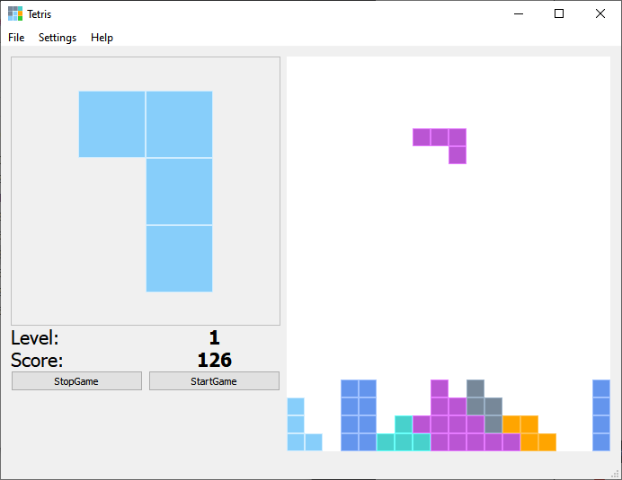

# Tetris

Tetris, the famous video game.

The game is implemented in C++ and uses the Qt5 framework to access the graphical interface.



## Dependencies

- Qt5

## Installation

Build Tetris with CMake or use Qt Creator.

Here is described how to build with CMake.

### Build with CMake

```bash
git clone <controLED-repo>
cd <controLED-project>
mkdir build
cd build
cmake ../
make
```

## Start the game

```bash
bin/tetris
```
